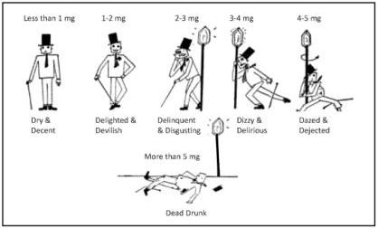
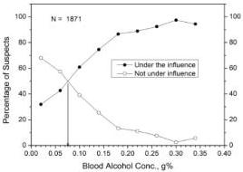
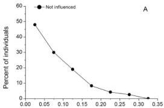
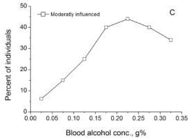
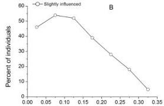
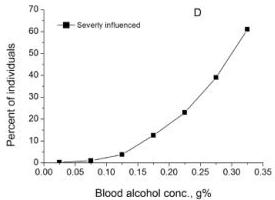

Journal of Analytical Toxicology, 2024, 48, 131–140
DOI: https://doi.org/10.1093/jat/bkae008
Advance Access Publication Date: 9 February 2024
Review

# Dubowski’s stages of alcohol influence and clinical signs and symptoms of drunkenness in relation to a person’s blood-alcohol concentration—Historical background

**Alan Wayne Jones**

Division of Clinical Chemistry and Pharmacology, Department of Biomedical and Clinical Sciences, Faculty of Medicine and Health Sciences, University of Linköping, Linköping SE-58183, Sweden

*Corresponding author: Division of Clinical Chemistry and Pharmacology, Department of Biomedical and Clinical Sciences, Faculty of Medicine and Health Sciences, University of Linköping, Linköping SE-58183, Sweden. Email: wayne.jones@liu.se

## Abstract

This article traces the origin of various charts and tables delineating the stages of alcohol influence in relation to the clinical signs and symptoms of drunkenness and a person’s blood-alcohol concentration (BAC). In forensic science and legal medicine, the most widely used such table was created by Professor Kurt M. Dubowski (University of Oklahoma). The first version of the Dubowski alcohol table was published in 1957, and minor modifications appeared in various articles and book chapters until the final version was published in 2012. Seven stages of alcohol influence were identified including subclinical (sobriety), euphoria, excitement, confusion, stupor, alcoholic coma and death. The BAC causing death was initially reported as 0.45+ g%, although the latest version cited a mean and median BAC of 0.36 g% with a 90% range from 0.21 g% to 0.50 g%. An important feature of the Dubowski alcohol table was the overlapping ranges of BAC for each of the stages of alcohol influence. This was done to reflect variations in the physiological effects of ethanol on the nervous system between different individuals. Information gleaned from the Dubowski table is not intended to apply to any specific individual but more generally for a population of social drinkers, not regular heavy drinkers or alcoholics. Under real-world conditions, much will depend on a person’s age, race, gender, pattern of drinking, habituation to alcohol and the development of central nervous tolerance. The impairment effects of ethanol also depend to some extent on whether observations are made on the rising or declining phase of the blood-alcohol curve (Mellanby effect). There will always be some individuals who do not exhibit the expected behavioral impairment effects of ethanol, such as regular heavy drinkers and those suffering from an alcohol use disorder.

## Introduction

Alcohol (ethanol) has been referred to as the Jekyll and Hyde of the drug world, which is an apt description considering that light-to-moderate drinking is virtually harmless, whereas overconsumption and abuse wrecks people’s lives (1). Excessive drinking and drunkenness are underlying factors in many types of criminal activity, such as drunken driving, sexual assault, unprovoked aggression, violent behavior, as well as homicide (2, 3). Consumption of alcohol lowers a person’s inhibitions, and this makes them more likely to take risks, such as driving a motor vehicle when drunk and/or engaging in unsafe sex (4, 5). The broad range of behavioral changes resulting from excessive drinking are common knowledge and must have been known for hundreds of years, because alcohol (ethanol) is our oldest recreational drug (6).

Ethanol-induced impairment depends primarily on the quantity consumed (the dose), the rate of drinking and the concentrations of ethanol reaching the blood and the brain. Rapid drinking on an empty stomach (bolus dose) leads to a faster absorption of ethanol into the bloodstream, a higher peak blood-alcohol concentration (BAC) and more pronounced effects on a person’s performance and behavior (7).

During police investigations of alcohol-related crimes, such as impaired driving and sexual assault, expert witnesses are often asked to interpret a person’s BAC in relation to the impairment effects of ethanol on the central nervous system. Questions might arise about changes in a person’s demeanor and personality when under the influence of alcohol or their ability to perform skilled tasks, such as driving. An expert witness might also be required to express an opinion about incapacitation after engaging in heavy drinking, such as whether a person was capable of forming intent or making rational decisions or giving consent with a certain BAC (8, 9).

To aid in interpreting BAC in a medicolegal context, various charts and tables have been constructed that list the expected clinical signs and symptoms of drunkenness in relation to the person’s BAC. One of the most widely used such tables in forensic science and legal medicine was constructed by Professor Kurt M. Dubowski (1921–2016) from the University of Oklahoma (10).

This article presents the historical background and origin of the Dubowski alcohol table, and it seems to have originated from research done by the National Safety Council (NSC) Committee on Tests for Intoxication. The early members of this committee were Emil Bogen (1886–1962), Clarence W. Muehlberger (1896–1966), Walter W. Jetter (1905–1994) and Herman A. Heise (1891–1983). Also relevant in this connection are studies done in the Nordic countries involving the examination of apprehended drivers by physicians, who were expected to document clinical signs and symptoms of impairment in relation to the suspect’s BAC (11, 12).

### Early studies of alcohol influence and/or intoxication

The first American study of the relationship between signs and symptoms of alcohol intoxication and the concentrations of ethanol in samples of breath and urine is credited to Emil Bogen (13, 14). After taking a medical degree from the University of Cincinnati School of Medicine in 1923, Bogen did an internship and residency at the Los Angeles General Hospital and afterwards returned to Cincinnati to conduct research toward an MS degree. This period in history (1928–1929) coincided with prohibition in the USA, and understandably, there was a lot of interest in overconsumption of alcohol in relation to making a clinical diagnosis of drunkenness, which was the subject of Bogen’s thesis.

This investigation involved the examination of patients admitted to hospital who were suspected of being intoxicated or abusers of alcohol and some needed to be treated for detoxification. Each patient was examined by a physician using a standardized protocol to document the person’s general appearance and demeanor, condition of the eyes, whether there was odor of alcohol on the breath, flushing of the face, dilated pupils, ability to walk without staggering, amount of swaying while standing with feet together and eyes closed. Other tests included slurred speech and ability to answer questions and touching the tip of the nose with a finger with eyes closed. The overall results from these clinical and observational measures culminated in making a diagnosis of alcohol intoxication. The clinical results were then correlated with the concentrations of ethanol determined in samples of the patient’s breath and/or urine (15).

One published article by Bogen involved a study with 100 patients suspected of alcohol abuse and alcoholism was done during his time working at a hospital in Los Angeles (16), and the same approach was used after his return to Cincinnati. The analytical method used to determine ethanol in samples of breath and urine was rather primitive and involved chemical oxidation with chromic acid. The concentration of ethanol in the biological samples was determined by visual comparison of the changes in color of the chemical reagent with a series of standard tubes containing known amounts of added ethanol. The conclusion reached from these studies was that the results from clinical tests of alcohol influence needed to be supported by the analysis of ethanol in breath or urine to support a diagnosis of alcohol intoxication.

The most comprehensive account of the research done by Bogen appeared in the American Journal of Medical Research in 1928 (17). The relationship between the percentage of patients judged to be intoxicated, and their urine-alcohol concentration (UAC) was as follows: 0% at UAC <0.1 g%, 56% at UAC 0.1–0.2 g%, 66% at UAC 0.2–0.3 g%, 88% at UAC 0.3–0.4 g%, 97% at UAC 0.4–0.5 g% and 100% at UAC >0.5 g%.

Regarding the collection of breath samples for analysis, Bogen found that 2 L of mixed expired breath contained about the same amount of alcohol as 1 mL of bladder urine, suggesting that the UAC/breath alcohol ratio is ~2000:1 (15). In this

connection, a warning flag was raised when he mentioned that breath should not be analyzed within the first 15 min after the end of drinking or after burping or belching. Under these conditions, the breath alcohol concentration might be artificially high, which today is referred to as the mouth alcohol effect (18, 19).

In a book entitled ALCOHOL AND MAN published in 1932, one of the chapters “The human toxicology of alcohol” was contributed by Bogen (20). This included a detailed account of his studies of the relationship between UAC and drunkenness, and in this connection, he identified five stages of alcohol influence (i) subclinical, (ii) stimulation, (iii) confusion, (iv) stupor and (v) coma and death (21). The graphic shown in Figure 1 was used by him to illustrate the relationship between observable signs and symptoms of alcohol influence in relation to increasing UAC.

This graph shows a man standing upright holding a cane apparently in fine form initially (subclinical); although after drinking alcohol to produce increasing concentrations in the urine, he has difficulty standing upright without support and the man is eventually incapable of standing at all. As UAC increases further, he falls to the ground dead drunk. These stages of alcohol influence were designated as:

- (i) Dry and decent (UAC < 1 mg/mL).
- (ii) Delighted and devilish (UAC 1–2 mg/mL).
- (iii) Delinquent and disgusting (UAC 2–3 mg/mL).
- (iv) Dizzy and delirious (UAC = 3–4 mg/mL).
- (v) Dazed and dejected (UAC = 4–5 mg/mL).
- (vi) Dead drunk (UAC > 5 mg/mL).

The pharmacological effects of alcohol on the central nervous system were compared with those caused by a general anesthetic agent (21). First, an excitation phase that removes inhibitory influences on higher centers of the brain, and this was followed by a phase of incoordination in which the mental and muscular balance is upset and cerebral confusion and physical ataxia are predominant. The person gradually becomes oblivious to his or her surroundings and insensitive to ordinary stimuli and might lapse into stupor and insensibility. Finally, the person enters a state of true anesthesia in which consciousness is lost and a comatose state persists.

### The work of the National Safety Council

In 1936, the NSC established a Committee on Test for Intoxication with the task of reviewing the medical literature to find information about the relationship between concentrations of ethanol in blood and other body fluids and the degree of impairment. The committee was interested in establishing some threshold BAC limits above which a person was unfit to drive, so that these could be presented in court as evidence when traffic offenders were prosecuted. One of the conclusions reached by the NSC committee was that the risk of a road-traffic crash increased in relation to the drivers’ BAC and UAC (22). The committee also proclaimed that the concentrations of ethanol in a person’s blood, breath or urine could be determined much more reliably than could the more subjective clinical signs and symptoms of drunkenness.

One of the early NSC members was Clarence W. Muehlberger, who was awarded both MS and PhD degrees from the University of Wisconsin (23). Between 1924 and 1930, Dr Muehlberger was employed as the State Toxicologist in Wisconsin before he moved to Chicago to take up a position as a toxicologist for the Cook County Coroner. His final appointment was as State Toxicologist of Michigan and Director of the Michigan Crime Detection Laboratory (23).

Figure 1. Graphic illustration of six stages of alcohol influence in relation to the concentration of ethanol in the person's urine, re-drawn after Bogen (21).

Table I. Five Stages of Alcohol Influence in Relation to BAC and UAC and the Clinical Signs and Symptoms of Intoxication According to a Table Constructed by Clarence Muehlberger and Published by the NSC in 1938 (63)

|  Stage of alcohol influence | Ethyl alcohol level (g/100 mL) |   | Clinical  |
| --- | --- | --- | --- |
|   |  Blood | Urine  |   |
|  Subclinical | 0.01–0.12 | 0.01–0.16 | Normal by ordinary observations. Slight change by special tests.  |
|  Stimulation | 0.09–0.21 | 0.13–0.29 | Decreased inhibitions. Emotional instability. Slight incoordination. Slowing of stimuli response.  |
|  Confusion | 0.18–0.30 | 0.26–0.42 | Disturbance of sensation. Decreased pain sense. Staggering gait. Slurred speech.  |
|  Stupor | 0.27–0.39 | 0.38–0.54 | Marked stimuli decrease. Approaching paralysis.  |
|  Coma | 0.36–0.48 | 0.51–0.67 | Complete unconsciousness. Depressed reflexes. Subnormal temperature. Anesthesia. Impairment of circulation. Stertorous (labored) breathing. Possible death.  |

Muehlberger was a strong advocate for using chemical test of intoxication as proof that a person was unfit to drive a motor vehicle on the highway and was in breach of drink-driving legislation. In Muehlberger's opinion clinical signs and symptoms were much too subjective, bordering on guesswork, and he based this opinion on the results of clinical studies published by Bogen and Jetter (24, 25).

In the 1938 Annual Report of the NSC Committee on Tests for Intoxication, Muehlberger constructed an “alcohol table” that delineated various stages of alcohol influence in relation to a person’s BAC and UAC and the expected signs and symptoms of drunkenness (see Table I) (26). Note that he used overlapping ranges of BAC and UAC and wrote “Overlapping stages of intoxication are shown to take into account the variation to be expected in relationship between blood-alcohol concentration and physical and mental impairment of different individuals.”

This alcohol table shown in Table I appears to be the first such compilation and also included a graphic showing a rising staircase with a man holding a cane on each step. As the concentration of alcohol in the man's urine increased so did his state of intoxication. The second step showed him having difficulties in standing upright, and he eventually had to lean against a lamp post, because he could no longer stand unaided. A coffin on the top step was meant to illustrate death from acute alcohol poisoning (26). Both the table and the graph appeared in Chapter 46 (Ethyl Alcohol) written by Muehlberger for the second edition of Legal Medicine—Pathology and Toxicology, an influential reference book edited by Gonzales et al. (27).

Herman A. Heise was another charter member of the NSC Committee on Tests for Intoxication, who became a strong supporter for use of chemical test evidence of intoxication for the prosecution of traffic offenders (28, 29). While working as a medical examiner, Heise became aware of the high prevalence of alcohol intoxication among drivers killed in road-traffic crashes and advocated that the analysis of ethanol needed to done routinely when victims of traffic deaths were autopsied and culpability for the crash was investigated (30, 31).

During the 1920–1930s, it was a lot easier to determine the concentration of ethanol in urine rather than in blood and there were also constitutional issues preventing taking blood samples. The latter was a more invasive procedure, not without medical risk and could not be done without the person's consent. This was not the case with urine, although Heise realized that BAC results were easier to interpret than UAC and he developed a method of blood-alcohol analysis that involved distillation followed by chemical oxidation with chromic acid and titrimetric analysis to determine an endpoint (32).

Herman A. Heise worked tirelessly to convince both state and federal authorities of the dangers of excessive drinking before driving, and these efforts led the NSC Committee to establish certain guidelines for use when traffic offenders were prosecuted (29, 33).

(i) Zone 1—BAC between 0.0 and 0.05 g% was taken as prima facie evidence that the person was not under the influence of alcohol.
(ii) Zone 2—BAC between 0.01 and 0.15 g% was not prima facie evidence of under the influence but was admissible if physical signs and symptoms also indicated impairment.
(iii) Zone 3—BAC >0.15 g% was prima facie evidence of being under the influence of alcohol.

These suggestions were accepted by some state legislators, such as New York State which amended its drink-driving statute in 1941 to read as follows:

"Upon the trial of any action or proceeding arising out of acts alleged to have been committed by any person arrested for operating a motor vehicle or motor cycle, while in an intoxicated condition, the court may admit evidence of the amount of alcohol in the defendant's blood taken within two hours of the time of the arrest, as shown by a medical or chemical analysis of his breath, blood, urine or saliva. For the purpose of this section (a) evidence that there was, at the time, five-hundredths of one per centum, or less, by weight of alcohol in the blood, is prima facie evidence that the defendant was not in an intoxicated condition; (b) evidence that there was, at the time, more than five-hundredths of one per centum and less than fifteen-hundredths of one per centum by weight of alcohol in his blood is relevant evidence, but it is not to be given prima facie effect in indicating whether or not the defendant was in an intoxicated condition; (c) evidence that there was, at the time, fifteen-hundredths of one per centum, or more, by weight of alcohol in his blood, may be admitted as prima facie evidence that the defendant was in an intoxicated condition."

The above wording does not make it perfectly clear whether the statute refers to % alcohol w/w or w/v and the difference between the two is 5.5%, because the average density of blood is 1.055 g/mL (34). However, it appears that laboratory methods of analysis used in the USA at the time were based on measuring aliquots of blood by volume, so % w/v is probably meant.

Another early study of the relationship between signs and symptoms of intoxication and BAC was reported by Walter W. Jetter in 1938 (35). This involved 1,000 patients admitted to hospital and were suspected of being chronic drinkers and/or needed detoxification. Each patient was examined by nurses and/or physicians using the same standardized protocol to document signs and symptoms of drunkenness. These included the odor of alcohol on the breath, flushed face, dilated pupils, abnormality of gait (walking a straight line and/or swaying, reeling and staggering), slurred speech, as well as ability to answer questions and communicate verbally were noted for each patient (36). Samples of blood and urine were then taken for determination of ethanol content so that a quantitative relationship was established between visual observations and BAC and/or UAC (32).

Table II. Relationship between BAC and Percentage of Patients Judged Intoxicated According to a 1938 Study by Jetter (36)

|  BAC range, g% | BAC midpoint, g% | Number of cases | Number (%) judged intoxicated  |
| --- | --- | --- | --- |
|  0.00–0.07 | 0.05 | 38 | 4 (10.5)  |
|  0.07–0.13 | 0.10 | 87 | 16 (18.5)  |
|  0.13–0.18 | 0.15 | 132 | 61 (47.0)  |
|  0.18–0.23 | 0.20 | 330 | 276 (83.6)  |
|  0.23–0.28 | 0.25 | 176 | 158 (90.0)  |
|  0.28–0.33 | 0.30 | 141 | 133 (95.1)  |
|  0.33–0.38 | 0.35 | 74 | 71 (96.0)  |
|  0.38–0.43 | 0.40 | 15 | 14 (93.3)  |
|  0.43–0.48 | 0.45 | 5 | 5 (100)  |
|  0.48–0.53 | 0.50 | 2 | 2 (100)  |

Table II shows the percentages of patients judged to be impaired by alcohol in relation to their BAC according to the study reported by Jetter (36). BAC in these patients ranged from 0.05 to 0.50 g%, and the percentage of patients judged intoxicated increased with increasing BAC. Overall, there were 740 patients (74%) diagnosed as intoxicated according to clinical parameters alone. There was considerable uncertainty in making this diagnosis when BAC was <0.15 g%. Indeed, some of the patients did not exhibit overt signs and symptoms despite them having a high BAC, which Jetter attributed to the development of central nervous tolerance in heavy drinkers. He later concluded that the evidence of intoxication in a legal context should not be based only on the results of a clinical examination and that this needed to be supported by measuring the concentration of ethanol samples of blood, breath or urine.

### Dubowski's alcohol table

The name Kurt M. Dubowski is tightly linked with research and teaching about forensic aspects of ethanol including determinations in body fluids and interpretation of the results in a legal context (10). After obtaining a BS degree in chemistry from New York University in 1946, this was followed by MS and PhD degrees from The Iowa State University. Thereafter Dubowski perused twin careers in clinical chemistry and laboratory medicine as well as forensic science and toxicology (37). In 1961, Dubowski was appointed full professor of medicine at the University of Oklahoma, and in 1981, he was promoted to the rank of distinguished professor.

Dubowski's bibliography lists 208 items comprising journal articles and reviews, book chapters, government reports, letters to the editor and some conference abstracts. His name appears as sole or first author on the vast majority of these publications. He possessed an unique knowledge of the forensic alcohol research literature including articles published in both English and German language journals.

The first Dubowski alcohol table was published in a journal called "Police" (Table III) in 1957 (38) and there are striking similarities to Muehlberger alcohol table published in 1938. Dubowski was aware of Muehlberger's table, because he included it in his PhD thesis published in 1949 entitled "Evaluation of methods for the determination of ethyl alcohol in biological materials" (39).

Table III. First Version of the Dubowski Table Published in 1957 (38) Showing Seven Stages of Alcohol Influence, in Relation to the Person's BAC and UAC and the Clinical Signs and Symptoms of Intoxication

|  Ethyl alcohol level (percent by weight) |   | Stage of alcohol influence | Clinical signs/symptoms  |
| --- | --- | --- | --- |
|  Blood | Urine  |   |   |
|  0.01–0.05 | 0.01–0.07 | Sobriety | No apparent influence. Behavior nearly normal by ordinary observation. Slight changes detectable by special tests.  |
|  0.03–0.12 | 0.04–0.16 | Euphoria | Mild euphoria, sociability, talkativeness. Increased self-confidence, decreased inhibitions. Diminution of attention, judgment and control. Loss of efficiency in finer performance tests.  |
|  0.09–0.25 | 0.12–0.34 | Excitement | Emotional instability, decreased inhibitions. Loss of critical judgment. Impairment of memory and comprehension. Decreased sensory response, increased reaction time. Some muscular incoordination.  |
|  0.18–0.30 | 0.24–0.41 | Confusion | Disorientation, mental confusion, dizziness. Exaggerated emotional states (fear, rage, grief, etc.). Disturbances of sensation (diplopia, etc.) and of perception of color, form, motion, dimensions. Decreased pain sense. Impaired balance, muscular incoordination; staggering gait; slurred speech.  |
|  0.27–0.40 | 0.37–0.54 | Stupor | Apathy, general inertia; approaching paralysis. Markedly decreased response to stimuli. Marked muscular incoordination; inability to stand or walk. Vomiting; incontinence of urine and feces. Impaired consciousness; sleep or stupor.  |
|  0.35–0.50 | 0.47–0.67 | Coma | Complete unconsciousness; coma; anesthesia. Depressed or abolished reflexes. Subnormal temperature. Incontinence of urine and feces. Embarrassment of circulation and respiration. Possible death.  |
|  0.45+ | 0.60+ | Death | Death from respiratory paralysis.  |

Both alcohol tables (Tables I and III) use overlapping ranges of BAC and UAC, although the "stimulation" stage in the Muehlberger table (BAC 0.09–0.21 g%) was split into two stages in the Dubowski table defined as euphoria (BAC 0.03–0.12 g%) and excitement (BAC 0.09–0.25 g%). The lowest BAC range (0.01–0.05 g%) was defined as "sobriety" in Dubowski's table, whereas Muehlberger referred to a BAC of 0.01–0.12 g% as subclinical (Table I). Descriptions of the various clinical signs and symptoms of drunkenness were similar but more elaborate in later versions of the Dubowski table.

The Dubowski alcohol table was widely disseminated by re-publication in scientific journals (40), book chapters (41) and government reports (42), which helped to spread the information to many forensic practitioners in the USA and other nations. The most recent version of the Dubowski table was published in the newsletter of the International Association of Chemical Testing and is shown in Table IV (43).

Close inspection of Dubowski's list of publications failed to reveal any clinical or observational studies with hospital patients or apprehended drivers to establish a relationship between BAC and the signs and symptoms of alcohol influence. It appears that Dubowski's alcohol table was synthesized from his vast knowledge of the scientific literature and articles published in clinical, biomedical and forensic toxicology journals.

The first two versions of the Dubowski table were published in 1957 and 1970, and these included information about UAC alongside BAC (41). The concentrations of ethanol in urine were calculated from the BAC by multiplying with a factor of ~1.33, which corresponds to the average UAC/BAC ratio for a freshly voided specimen in the post-absorptive phase of the BAC curve (44, 45).

Forensic toxicologists are often hesitant or refuse to interpret urinary drug concentrations in relation the pharmacological effects on the individual and/or the amount of drug consumed (46, 47). However, interpretation of UAC is a lot easier, because of the high correlation between UAC and BAC as reported from controlled drinking studies (48) and in apprehended drivers (45).

Concentration of ethanol in bladder urine reflects the BAC during the time when urine was formed in the kidney and stored in the bladder before voiding. However, many factors influence UAC and UAC/BAC ratios, such as the frequency of urination, the elapsed time between successive voids and retention of residual urine in the bladder (49). Because BAC is continuously changing through metabolism in the liver and when collected in the bladder the ethanol is protected from metabolism. The measured UAC reflects the average BAC since the previous void (44). Scores of studies demonstrate that BAC and UAC are highly correlated especially if voids are collected during the post-absorptive phase of ethanol metabolism (48).

Overlapping BAC ranges is an important feature of both the Muehlberger and the Dubowski alcohol tables, although neither explained how they arrived at these ranges. Dubowski wrote "The deliberate overlap between the stages reflects the existence of some variation in these effects among individuals, a recognized biological phenomena" (42). In his table, the differences in BAC for each stage of alcohol influence were 0.04 g% (subclinical), 0.09 g% (euphoria), 0.16 g% (excitement), 0.12 g% (confusion), 0.15 g% (stupor) and 0.15 g% (coma). The latest 2012 version of the Dubowski table also mentions that the information it contains applies to a typical social drinker, not to chronic alcohol abusers (43).

Table IV. Most Recent Version of the Dubowski Alcohol Table (2012) Depicting Seven Stages of Alcohol Influence with Overlapping Ranges of BAC and the Associated Clinical Signs and Symptoms of Intoxication (43)

|  BAC (g/100 mL) | Stage of alcoholic influence | Clinical signs and/or symptoms  |
| --- | --- | --- |
|  0.01–0.05 | Subclinical | Behavior nearly normal by ordinary observation. Influence/effects usually not apparent or obvious. Impairment detectable by special tests.  |
|  0.03–0.12 | Euphoria | Mild euphoria, sociability, talkativeness. Increased self-confidence; decreased inhibitions. Diminished attention, judgment and control. Some sensory-motor impairment. Slowed information processing. Loss of efficiency in critical performance tests.  |
|  0.09–0.25 | Excitement | Emotional instability; loss of critical judgment. Impairment of perception, memory, and comprehension. Decreased sensory response; increased reaction time. Reduced visual acuity and peripheral vision and slower glare recovery. Sensory-motor incoordination; impaired balance; slurred speech. Vomiting; drowsiness.  |
|  0.18–0.30 | Confusion | Disorientation, mental confusion; vertigo; dysphoria. Exaggerated emotional states (fear, rage, grief, etc.). Disturbances of vision (diplopia, etc.) and of perception of color, form, motion, dimensions. Increased pain threshold. Increased muscular incoordination; staggering gait; ataxia. Memory loss. Apathy with progressive lethargy.  |
|  0.25–0.40 | Stupor | General inertia; approaching loss of motor functions. Markedly decreased response to stimuli. Marked muscular incoordination; inability to stand or walk. Vomiting; incontinence of urine and feces. Impaired consciousness; sleep or stupor; deep snoring.  |
|  0.35–0.50 | Coma | Complete unconsciousness; coma; anesthesia. Depressed or abolished reflexes. Subnormal temperature. Impairment/irregularities of circulation and respiration. Possible death.  |
|  Mean, median 0.36 (90% 0.21–0.50) | Death | Death from respiratory failure and/or cardiac arrest.  |

The untoward effects of alcohol on an individual are difficult to detect clinically at BAC between 0.01 and 0.05 g% unless more sophisticated cognitive and/or divided attention psychomotor tasks are applied (50–52). More unequivocal is the BAC associated with death, which was reported as 0.45+ g% in early versions of Dubowski's table but complemented in the latest version with a mean and median concentration of 0.36 g% and a 90% range from 0.21 to 0.50 g% (53). These values are in good agreement with several autopsy studies involving the determination of ethanol in femoral blood when no other drugs were identified (54, 55). Note that the BAC of a 0.36 g% reflects time of death, and this was probably higher some time before death, owing to an ongoing metabolism of ethanol up until the time of death when blood circulation ends.

### Clinical examination of apprehended drivers

Another source of information about the relationship between BAC and the clinical signs and symptoms of intoxication can be gleaned from drink-driving cases when suspects were examined by clinicians without any knowledge of the BAC. The BAC in apprehended drivers covers a wide range from below the legal limit for driving up to 0.4 g% (56). Beginning in the 1930s, every person suspected of driving under the influence of alcohol in Sweden was examined by a physician.

The examination of suspects was done ~60–90 min after the arrest, and a physician or police surgeon used a questionnaire and standardized protocol for this purpose. Thereafter, a battery of simple observational, cognitive and psychomotor tests were administered including noting the person's demeanor, orientation in time and space, odor of alcohol on their breath, Romberg's balance test, walking a straight line, turning around, finger-nose test, picking up small objects, counting backwards starting at 107, and any disturbances in speech, such as stammering (57). After completion of the clinical examination, the physician was expected to conclude whether the person was or was not under the influence of alcohol. If judged to be under the influence, this was then graded as being slight, moderate or severe and finally a sample of blood was collected for the determination of ethanol at a forensic laboratory.

Many studies of this kind were undertaken in the Nordic countries where statutory BAC limits for driving were introduced decades before other nations (57). Figure 2 shows percentages of apprehended drivers judged impaired by alcohol in relation to those not considered to be impaired in relation to the measured BAC (58). The graph shows that 50% of drivers were considered influenced by alcohol at a BAC of ~0.075 g% and these results were collected during the early 1960s. Similar studies with apprehended drivers have been done in Finland, and the results were in good agreement with those displayed in Figure 2 (59, 60).

Figure 2. Percentages of apprehended drivers judged under the influence of alcohol according to a clinical examination done 60–90 min after arrest in relation to BAC in g/100 g (g%).

Figure 3. Relationship between percentage of drivers considered not under the influence of alcohol (A) in relation to increasing BACs (g/100 g or g%) compared with percentages of individuals judged as slightly (B), moderately (C) or severely (D) impaired by alcohol (11).

Based on a much larger material of apprehended drivers, Figure 3A shows the percentage of those examined considered “not under the influence of alcohol” whereas Figures 3B–D depicts the percentages of drivers determined to be slightly, moderately or severely impaired by alcohol (11). One notices that ~2.5% of suspects were not considered influenced despite having a BAC between 0.25 and 0.29 g% (Figure 3A), whereas 18 (0.8%) of individuals with BAC <0.1 g% were considered severely impaired by alcohol. These findings underscore the difficulty in relying only on the results of clinical tests for use as evidence when traffic offenders are prosecuted.

One problem with this type of study is that the physician who examines the suspects knows that they have been arrested by the police for drunken driving, which introduces an element of cognitive bias (61). Another factor is that the arrests were made throughout the whole country and hundreds of different physician were involved with making the clinical examinations. Reliability and consistency of their diagnosis might therefore depend on the amount of training for this task and their enthusiasm to make themselves available at all times of day and night.

## Discussion

There are numerous graphs and tables available that illustrate the clinical signs and symptoms of drunkenness in relation to the amount of alcohol consumed and the concentration of ethanol determined in samples of the person’s blood, breath, and/or urine (56, 62). Most such tabulations use fixed BAC intervals, such as 0.0–0.05 g%, 0.06–0.10 g%, etc., and alongside are listed the expected signs and symptoms. Muehlberger’s alcohol table (63) was the first to utilize overlapping BAC ranges, and this was also adopted by Dubowski, albeit with somewhat different BAC ranges and one additional stage of alcohol influence (43).

Many factors influence how people react to drinking alcoholic beverages, including their age and personality, the quantity (dose) consumed, the rate of consumption, and the resulting concentrations of ethanol in the blood and the brain (64). Most light-to-moderate drinkers seldom tolerate the amounts of ethanol necessary to reach a BAC of 0.15 g% (65), owing to nausea and other untoward effects experienced. Binge drinking is required to reach such high BAC (66), and most novice drinkers would vomit when their BAC rises rapidly to surpass 0.12 g% (unpublished observations from hundreds of controlled alcohol dosing studies).

On the other hand, seasoned drinkers tolerate massive amounts of alcohol and don’t exhibit the expected impairment effects, despite reaching a very high BAC (64). A recent pertinent study was reported by Olson et al. (67). They investigated patients presenting to a hospital emergency department (n = 384), who were perceived to be under the influence of alcohol on admission. All were subsequently examined by nurses and/or physicians using a so-called “alcohol symptoms check list.” The examiners were also expected to guess the patient’s BAC before a breath sample was analyzed with a hand-held instrument (AlcoSensor III).

The measured BAC of the patients in the Olson et al. study ranged from 0 to 0.418 g% and the estimated BAC, based on the results of the clinical tests, correlated well with the actual BAC (r = 0.513). However, the correlation between BAC and the overall clinical intoxication scores was low (r = 0.250). This improved somewhat when only patients (n = 134) without a history of chronic drinking were considered (r = 0.363). The correlation was much worse (r = 0.154) in those patients (n = 250) that had medical records documenting a previous history of chronic drinking. The overall conclusion from the study was that BAC was not well correlated with outward physical signs of intoxication, especially in chronic drinkers, because the development of central nervous tolerance tends to mask the clinical signs of intoxication in such individuals (68).

Although the results from several autopsy studies reported that the victims of acute alcohol poisoning had a BAC between 0.3 and 0.4 g%, there are many exceptions (53). Some people attempt to drive a motor vehicle with BAC exceeding 0.4 g% (69). Why some people die at a BAC of 0.4 g% and others survive is not so easy to explain, although some of the following might be relevant to consider:

- (i) The person’s age, gender, ethnicity and previous drinking experience, hence the development of central nervous tolerance.
- (ii) The rate of alcohol consumption to reach a dangerously high BAC, hence time elements and the type of beverage, whether beer or spirits.
- (iii) Co-ingestion of other drugs, especially central nervous depressant (e.g., benzodiazepines or barbiturates), which tends to cause death at a lower mean BAC.
- (iv) Positional asphyxia, such as being slumped in a chair with restricted breathing when incapacitated from heaving drinking.
- (v) Aspiration of vomit—postmortem BAC might be fairly low in such cases and the cause of death is then attributed to asphyxiation.
- (vi) The person’s general state of health—medical conditions especially various pulmonary diseases like asthma, emphysema and/or chronic obstructive pulmonary disease.
- (vii) Environmental factors, such as sleeping outdoors and being exposed to low ambient temperature, because hypothermia enhances ethanol toxicity.

There are no effective antidotes to treat patients admitted to hospital for ethanol poisoning (70, 71). Pumping the stomach or administration of active charcoal are not very helpful, because in most instances ethanol is already absorbed and distributed in all body fluids when medical intervention commences (72). The poisoned patient needs to be kept warm and hydrated, and checks made to ensure they don’t aspirate vomit into the lungs when in a semi-conscious state.

Most patients usually recover spontaneously when their BAC decreases <0.10 g% by metabolism of ethanol in the liver, which occurs at a rate of 0.015–0.025 g% per hour (73).

The articles published by Bogen in the late 1920s appear to be the first American studies to establish a quantitative relationship between UAC and the signs and symptoms of drunkenness (17). A more extensive study was done by Jetter in 1938, which also involved people admitted to hospital who were known or suspected of abusing alcohol (36). Taken together with the studies done with apprehended drivers from Sweden, the results verify large inter-subject variations in the signs and symptoms of alcohol influence at one and the same BAC range (11, 12). Results of clinical examinations alone should not be presented in evidence when apprehended drivers are prosecuted. Clinical test results need to be complemented by measuring the concentration of ethanol in samples of the person’s blood, breath, or urine. This was pointed out in a fairly recent review article entitled “Intoxication is not always visible: An unrecognized prevention challenge” (64).

The take home message from this dive into the history of BAC vs. intoxication charts underscores that the quantitative analysis of ethanol in body fluids is a much more reliable test of excessive drinking than behavioral signs and symptoms. Clinical observations and simple cognitive and psychomotor tests, such as field sobriety tests, are necessarily subjective and much depends on the experience, skill and training of the person who administers the tests (74, 75). Measuring the BAC furnishes a more objective way to establish whether a person exceeds the statutory limit for driving, and if necessary, the analytical results can be converted into the amount of alcohol absorbed and distributed in all body fluids (62).

In conclusion, Clarence Muehlberger should be credited with creating the first alcohol table delineating clinical signs and symptoms of intoxication in relation to the person’s BAC and UAC (26). This information was later updated and improved upon by Dubowski starting in 1957 and continuing to 2012 (38). The Dubowski alcohol table has proven useful as a teaching tool about the effects of ethanol on the central nervous system, and also in jurisprudence when expert witnesses are asked to interpret a person’s BAC in relation to various stages of intoxication, such as when alcohol-related crimes are prosecuted.

Remember that the information gleaned from using the Dubowski alcohol table is not intended to apply to any given individual. Instead, it provides guidelines that apply to a population of social drinkers and not to chronic alcohol abusers, because the latter have developed central nervous tolerance to ethanol’s impairment effects. In the real world, much will depend on the pattern of drinking, the type of beverage consumed, the time after drinking when observations are made and any co-ingested central nervous depressant drugs. There will always be some individuals who do not exhibit the expected behavioral impairment one expects to find at a certain BAC, such as regular heavy drinkers and those diagnosed with an alcohol use disorder.

## Data availability

The literature review necessary to prepare this manuscript used published articles, books and government reports available in the public domain via libraries, the internet and other resources.

## Funding

There was no external funding applied for or received to prepare this article.

## Conflicts of interest

The author (AW Jones) does not consider that he has any conflicts of interest in publishing this article.

## References

1. Gibbons, B. (1992) Alcohol, the legal drug. National Geographic, 181, 3–35.

2. Sontate, K.V., Rahim Kamaluddin, M., Naina Mohamed, I., Mohamed, R.M.P., Shaikh, M.F., Kamal, H., et al. (2021) Alcohol, aggression, and violence: from public health to neuroscience. Frontiers in Psychology, 12, 699726.

3. Richardson, A., Budd, T. (2003) Young adults, alcohol, crime and disorder. Criminal Behaviour and Mental Health, 13, 5–16.

4. Brown, J.L., Gause, N.K., Northern, N. (2016) The association between alcohol and sexual risk behaviors among college students: a review. Current Addiction Reports, 3, 349–355.

5. Alonso, F., Pastor, J.C., Montoro, L., Esteban, C. (2015) Driving under the influence of alcohol: frequency, reasons, perceived risk and punishment. Substance Abuse Treatment, Prevention and Policy, 10, 11.

6. Curry, A. (2017) The birth of booze—our 9000 year love affair with alcohol. National Geographic, 231, 30–53.

7. Holland, M.G., Ferner, R.E. (2017) A systematic review of the evidence for acute tolerance to alcohol—the “Mellanby effect”. Clinical Toxicology (Philadelphia, Pa.), 55, 545–556.

8. Kalant, H. (1996) Intoxicated automatism: legal concept vs. scientific evidence. Contemporary Drug Problems, 23, 631–648.

9. Kaysen, D., Neighbors, C., Martell, J., Fossos, N., Larimer, M.E. (2006) Incapacitated rape and alcohol use: a prospective analysis. Addictive Behaviors, 31, 1820–1832.

10. Jones, A.W., Essary, N. (2021) An appreciation of the life and career of Professor Kurt Max Dubowski on the 100th anniversary of his birth. IACT Newsletter, 32, 3–11.

11. Bonnichsen, R.K., Dimberg, R., Maehly, A., and Åqvist, S. (1967) Alkohol och påverkan (alcohol and intoxication). Institutet För Maltdrycksforskning, 17, 1–8.

12. Widmark, E.M.P. (1981) Principles and Application of Medicolegal Alcohol Determinations. Biomedical Publications: Davis, pp. 1–163.

13. Brodsky, M.L. (1963) In memoriam Emil Bogen (1896–1962). American Journal of Clinical Pathology, 40, 640.

14. Froman, S., Will, D. (1963) Emil Bogen (1896–1962). American Review of Respiratory Diseases, 87, 300.

15. Bogen, E. (1927) Drunkenness—a quantitative study of acute alcoholic intoxication. JAMA, 89, 1508–1511.

16. Bogen, E. (1927) The diagnosis of drunkenness—a quantitative study of acute alcoholic intoxication. California and Western Medicine, 26, 778–783.

17. Bogen, E. (1928) Drunkenness—a quantitative study of acute alcohol intoxication. American Journal of the Medical Sciences, 176, 153–167.

18. Caddy, G.R., Sobell, M.B., Sobell, L.C. (1978) Alcohol breath tests: criterion times for avoiding contamination by “mouth alcohol”. Behaviour Research Methods and Instrumentation, 10, 814–818.

19. Gullberg, R.G. (1992) The elimination rate of mouth alcohol: mathematical modeling and implications in breath alcohol analysis. Journal of Forensic Sciences, 37, 1363–1372.

20. Emerson, H. (ed.). (1932) Alcohol and Man—The Effects of Alcohol on Man in Health and Disease. The Macmillian Company: New York.

21. Bogen, E. The human toxicology of alcohol. Chapter VI. In: Emerson, H. (ed.). (1932) Alcohol and Man—The Effects of Alcohol on Man in Health and Disease. The Macmillian Company: New York, pp. 126–152.

22. National Safety Council. (1937) Test for driver intoxication. National Safety Council Report, pp. 1–32.

23. Harger, R.N. (1967) Clarence W. Muehlberger 1896–1966. Journal of Forensic Sciences, 12, vii–viii.

24. Muehlberger, C.M. (1947) Chemical tests for alcoholic intoxication. American Practitioner and Digest of Treatment, 1, 360–362.

25. Muehlberger, C.W. (1948) Medicolegal aspects of chemical tests of alcoholic intoxication. Journal of Criminal Law and Criminology, 39, 411–416.

26. Muehlberger, C.W. (1938) Chemical tests for intoxication. Report of the Committee on Tests for Intoxication. National Safety Council, pp. 1–39.

27. Gonzales, T.A., Vance, M., Helpern, M., Umberger, C.J. (1954) Legal Medicine. Pathology and Toxicology. Appleton-Century-Crofts: New York, pp. 1–1297.

28. Heise, H.A. (1940) Chemical tests for alcoholic intoxication. JAMA, 114, 1391.

29. Heise, H.A. (1958) Chemical tests for intoxication. Rocky Mountain Medical Journal, 55, 46–51.

30. Heise, H.A. (1934) Alcohol and automobile accidents. JAMA, 103, 739–741.

31. Turner, R.F., Heise, H.A., Muehlberger, C.W. (1958) Interpretation of tests for intoxication. JAMA, 619, 1359–1362.

32. Heise, H.A. (1934) The specificity of the test for alcohol in body fluids. American Journal of Clinical Pathology, 4, 182–188.

33. Heise, H.A. (1967) Concentrations of alcohol in samples of blood and urine taken at the same time. Journal of Forensic Sciences, 12, 454–461.

34. Lentner C. (1981). Geigy Scientific Tables. Vol. 1, Basle: Ciba-Geigy, pp. 1–295.

35. Jetter, W.W. (1938) Studies in alcohol. II. Experimental feeding of alcohol to non-alcoholic individuals. American Journal of the Medical Sciences, 196, 487–493.

36. Jetter, W.W. (1938) Studies in alcohol. I. Diagnosis of acute alcoholic intoxication by a correlation of clinical and chemical findings. American Journal of the Medical Sciences, 196, 475–487.

37. Jones, A.W. (2018) Profiles in forensic toxicology: Professor Kurt M. Dubowski (1921–2017). TIAFT Bulletin, 48, 12–26.

38. Dubowski, K.M. (1957) Stages of acute alcoholic influence/intoxication. Police, 1, 32.

39. Dubowski, K.M. (1949) Evaluation of methods for the determination of ethyl alcohol in biological materials. PhD thesis. The Iowa State University, pp. 1–720.

40. Dubowski, K.M. (1980) Alcohol determination in the clinical laboratory. American Journal of Clinical Pathology, 74, 747–750.

41. Dubowski, K.M. Measurement of ethyl alcohol in breath. In: Sunderman, F.W., Sundermann, F.W. Jr. (eds.). (1970) Laboratory Diagnosis of Diseases Caused by Toxic Agents. Chapter 31. Warren H Green, Inc: St Louis, pp. 316–342.

42. Dubowski, K.M. (1977) Manual for analysis of ethanol in biological liquids. National Highway Traffic Safety Administration. Government Printing Office: Washington DC, pp. 1–118.

43. Dubowski, K.M. (2012) The Dubowski alcohol table. IACT Newsletter, 23, 7–8.

44. Jones, A.W. (2002) Reference limits for urine/blood ratios of ethanol in two successive voids from drinking drivers. Journal of Analytical Toxicology, 26, 333–339.

45. Jones, A.W. (2006) Urine as a biological specimen for forensic analysis of alcohol and variability in the urine-to-blood relationship. Toxicological Reviews, 25, 15–35.

46. Kale, N. (2019) Urine drug tests: ordering and interpreting results. American Family Physician, 99, 33–39.

47. ANSI/ACB. (2019) Guidelines for opinion testimony in forensic toxicology. Best Practice Recommendations. 1st edition, 037, pp. 1–5.

48. Jones, A.W. (1992) Ethanol distribution ratios between urine and capillary blood in controlled experiments and in apprehended drinking drivers. Journal of Forensic Sciences, 37, 21–34.

49. Biasotti, A.A., Valentine, T.E. (1985) Blood alcohol concentration determined from urine samples as a practical equivalent or alternative to blood and breath alcohol tests. Journal of Forensic Sciences, 30, 194–207.

50. Brumback, T., Cao, D., King, A. (2007) Effects of alcohol on psychomotor performance and perceived impairment in heavy binge social drinkers. Drug and Alcohol Dependence, 91, 10–17.

51. Dry, M.J., Burns, N.R., Nettelbeck, T., Farquharson, A.L., White, J.M., Mendelson, J.E. (2012) Dose-related effects of alcohol on cognitive functioning. PLoS One, 7, e50977.

52. Gilbertson, R., Ceballos, N.A., Prather, R., Nixon, S.J. (2009) Effects of acute alcohol consumption in older and younger adults: perceived impairment versus psychomotor performance. Journal of Studies on Alcohol and Drugs, 70, 242–252.

53. Jones, A.W., Holmgren, P. (2003) Comparison of blood-ethanol concentration in deaths attributed to acute alcohol poisoning and chronic alcoholism. Journal of Forensic Sciences, 48, 874–879.

54. Kriikku, P., Ojanpera, I. (2020) Significant decrease in the rate of fatal alcohol poisonings in Finland validated by blood alcohol concentration statistics. Drug and Alcohol Dependence, 206, 107722.

55. Tormey, W.P., Moore, T.M. (2013) Ethanol as a single toxin in non-traumatic deaths—a toxicology perspective. Legal Medicine (Tokyo, Japan), 15, 122–125.

56. Jones, A.W., Holmgren, A. (2009) Age and gender differences in blood-alcohol concentration in apprehended drivers in relation to the amounts of alcohol consumed. Forensic Science International, 188, 40–45.

57. Jones, A.W. (2022) How Nordic countries enforce impaired driving legislation. Forensic Science Review, 34, 131–143.

58. Bonnichsen, R.K. (1963) Medicinsk expertredogörelse. Nykterhet i trafiken. Statens Offentliga Utredningar: Stockholm, pp. 239–292.

59. Penttilä, A., Tenhu, M. (1976) Clinical examination as medicolegal proof of alcohol intoxication. Medicine Science and the Law, 16, 95–103.

60. Penttilä, A., Kataja, M., and Tenhu, M. (1975) Examination model for suspected drunken driving. Blutalkohol, 12, 24–38.

61. Hamnett, H.J., Jack, R.E. (2019) The use of contextual information in forensic toxicology: an international survey of toxicologists’ experiences. Science and Justice, 59, 380–389.

62. Jones, A.W. Analysis, disposition, and fate of ethnaol in the body with applications in clinical and forensic toxicology. In: Karch, S.H., Goldberger B.A. (eds). (2023) Karch’s Drug Abuse Handbook, 3rd edition. CRC Press: Boca Raton, pp. 206–243.

63. National Safety Council. (1938) Intoxication test evidence—chemical tests for intoxication. National Safety Council: Chicago, pp. 1–39.

64. Brick, J., Erickson, C.K. (2009) Intoxication is not always visible: an unrecognized prevention challenge. Alcoholism: Clinical and Experimental Research, 33, 1489–1507.

65. White, A.M., Tapert, S., Shukla, S.D. (2018) Binge drinking. Alcohol Research: Current Reviews, 39, 1–3.

66. Hingson, R.W., Zha, W., White, A.M. (2017) Drinking beyond the binge threshold: predictors, consequences, and changes in the US. American Journal of Preventive Medicine, 52, 717–727.

67. Olson, K.N., Smith, S.W., Kloss, J.S., Ho, J.D., Apple, F.S. (2013) Relationship between blood alcohol concentration and observable symptoms of intoxication in patients presenting to an emergency department. Alcohol and Alcoholism, 48, 386–389.

68. Kalant, H. (1996) Current state of knowledge about the mechanisms of alcohol tolerance. Addiction Biology, 1, 133–141.

69. Jones, A.W., Harding, P. (2013) Driving under the influence with blood alcohol concentrations over 0.4 g%. Forensic Science International, 231, 349–353.

70. Kraut, J.A., Kurtz, I. (2008) Toxic alcohol ingestions: clinical features, diagnosis, and management. Clinical Journal of the American Society of Nephrology, 3, 208–225.

71. McMartin, K., Jacobsen, D., Hovda, K.E. (2016) Antidotes for poisoning by alcohols that form toxic metabolites. British Journal of Clinical Pharmacology, 81, 505–515.

72. Kraut, J.A., Mullins, M.E., Campion, E.W. (2018) Toxic alcohols. New England Journal of Medicine, 378, 270–280.

73. Jones, A.W. (2010) Evidence-based survey of the elimination rates of ethanol from blood with applications in forensic casework. Forensic Science International, 200, 1–20.

74. Burns, M. (2003) An overview of field sobriety test research. Perceptual and Motor Skills, 97, 1187–1199.

75. Hlastala, M.P., Polissar, N.L., Oberman, S. (2005) Statistical evaluation of standardized field sobriety tests. Journal of Forensic Sciences, 50, 662–669.

Downloaded from https://academic.oup.com/jat/article/48/3/131/7604366 by TIAFT Member Access user on 08 April 2024